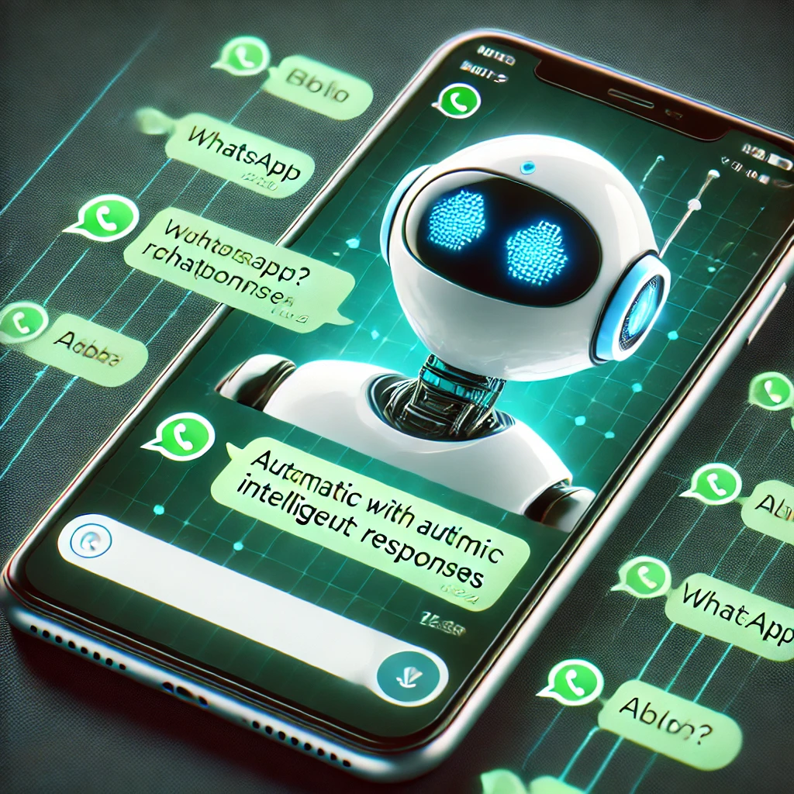

# Projeto: wpp_bot_ai - Chatbot com IA para WhatsApp



## Descrição

O **wpp_bot_ai** é um chatbot para WhatsApp que utiliza Inteligência Artificial para responder automaticamente a mensagens dos seus clientes ou contatos. Ele usa uma arquitetura de RAG (Retrieval-Augmented Generation) para buscar informações e fornecer respostas personalizadas, baseadas nos dados da sua empresa.

## Funcionalidades

- Integração com WhatsApp via API do Waha.
- Respostas geradas por IA utilizando LLaMA e LangChain.
- Arquitetura baseada em RAG com Chroma DB (em desenvolvimento) para fornecer respostas personalizadas.
- Implementação e escalabilidade via Docker.
- Aceleração de processamento com Groq.

## Tecnologias Utilizadas

- Python 3.x
- Framework: Flask
- Módulos e Ferramentas:
  - `LangChain`: Para gerenciar as interações de IA.
  - `LLaMA`: Para geração de respostas em linguagem natural.
  - `Docker`: Para containerização e escalabilidade.
  - `Groq`: Para aceleração de IA.
  - `Waha API`: Para integração com WhatsApp.
  - `Chroma DB`: Para armazenar e consultar dados personalizados (em desenvolvimento).

## Como Rodar o Projeto

1. **Pré-requisitos**:

   - Ter o Python 3.x e Docker instalados na sua máquina.

2. **Instalação**:

   - Clone o repositório em sua máquina local:
     ```bash
     git clone https://github.com/eugfl/wpp_bot_ai.git
     ```
   - Entre na pasta do projeto:
     ```bash
     cd wpp_bot_ai
     ```
   - Abra com o seu editor de código:
     ```bash
     code .
     ```

3. **Configuração**:

   - Configure as variáveis de ambiente com as credenciais da API do Waha e outras necessárias.

4. **Rodar**:
   - Construa e inicie o Docker:
     ```bash
     docker-compose up --build
     ```

Feito com ♥ by [eugfl](https://www.linkedin.com/in/eugfl/)
